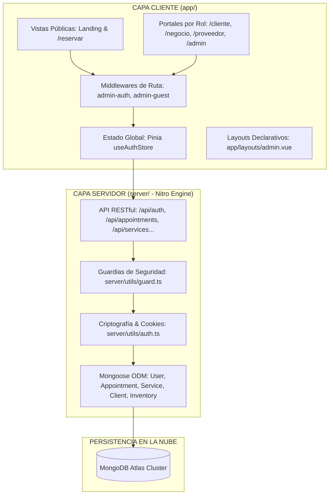

# 🌸 Documentación Técnica Integral - Plataforma LookBy

**Versión del Proyecto:** 1.0.0 (Nuxt 4 / MongoDB Atlas)  
**Autor / Desarrollador:** Deiby Camacho  
**Repositorio Oficial:** [https://github.com/DeibyCamacho/LookBy](https://github.com/DeibyCamacho/LookBy)  
**Fecha de Documentación:** Agosto 2026  

---

## 1. 📌 Ficha Técnica y Stack Tecnológico

| Componente | Tecnología / Librería | Versión / Detalle |
|---|---|---|
| **Framework Full-Stack** | [Nuxt 4](https://nuxt.com/) | `v4.5.2` (Vue 3.5+, Nitro 2.13+, Vite 8.2+) |
| **Lenguaje** | [TypeScript](https://www.typescriptlang.org/) | Tipado estricto en cliente y servidor |
| **Base de Datos** | [MongoDB Atlas](https://www.mongodb.com/atlas) | Base de datos NoSQL en la nube |
| **ORM / ODM** | [Mongoose](https://mongoosejs.com/) | `v9.9.2` con esquemas tipados |
| **Gestión de Estado** | [Pinia](https://pinia.vuejs.org/) | `@pinia/nuxt v1.0.2` (Composition API) |
| **Seguridad & Tokens** | [jsonwebtoken](https://github.com/auth0/node-jsonwebtoken) & [bcryptjs](https://github.com/dcodeIO/bcrypt.js) | JWT en cookies `httpOnly`, Hash con Salt 10 |
| **Control de Temas** | [@nuxtjs/color-mode](https://color-mode.nuxtjs.org/) | Modo Claro / Modo Oscuro nativo con CSS vars |
| **Notificaciones** | [Resend](https://resend.com/) | API para envío de correos transaccionales |

---

## 2. 🎯 Propósito y Alcance del Sistema

**LookBy** es una plataforma web integral diseñada para digitalizar y centralizar el ecosistema de belleza y estética (salones, barberías, spas, distribuidores de insumos y clientes finales).

### Objetivos Clave:
1. **Para Clientes**: Brindar un portal de autoservicio para explorar tratamientos, agendar citas en tiempo real (con bloqueo automático de horarios ocupados) y gestionar su historial de visitas.
2. **Para Negocios / Profesionales**: Proveer un panel de control con métricas financieras (ingresos mensuales), control de agenda, directorio de clientes, tarifas de servicios y stock de productos con alertas de nivel crítico.
3. **Para Proveedores**: Ofrecer un espacio para comercializar suministros e insumos de belleza al por mayor directamente a los salones.
4. **Para el Superadministrador**: Facilitar la gobernanza global de la plataforma, moderación de usuarios, cambio de roles y resolución de casos excepcionales.

---

## 3. 🏛️ Arquitectura del Sistema

El proyecto implementa una **Arquitectura Unificada (Monolito Modular Moderno)** dividida en dos capas principales:



---

## 4. 📂 Estructura Detallada de Carpetas y Archivos

```
LookBy-main/
├── app/                          # Capa de Frontend y Experiencia de Usuario
│   ├── app.vue                   # Punto de entrada raíz envuelto en <NuxtLayout>
│   ├── error.vue                 # Capturador personalizado de errores 404 / 500
│   ├── assets/css/main.css       # Variables CSS globales (paleta de colores, modo día/noche)
│   ├── components/
│   │   └── ThemeToggle.vue       # Alternador de tema Claro / Oscuro
│   ├── layouts/
│   │   └── admin.vue             # Layout de administración con Sidebar, TopBar fija y Breadcrumbs
│   ├── middleware/
│   │   ├── admin-auth.ts         # Guardián de autenticación y aislamiento estricto por rol
│   │   └── admin-guest.ts        # Redirección inteligente de usuarios autenticados
│   ├── stores/
│   │   └── auth.ts               # Store Pinia con Composition API (login, register, logout, fetchUser)
│   └── pages/                    # Enrutamiento basado en archivos
│       ├── index.vue             # Landing page comercial con catálogo en vivo
│       ├── reservar.vue          # Wizard interactivo de reservas en 4 pasos con bloqueo de horarios
│       ├── cliente/index.vue     # Portal exclusivo para clientes (Mis Citas y perfil)
│       ├── negocio/index.vue     # Dashboard del salón (ingresos, métricas y accesos rápidos)
│       ├── proveedor/index.vue   # Portal de proveedores de insumos al por mayor
│       └── admin/                # Panel de Superadministrador y módulos CRUD
│           ├── index.vue         # Hub de movilidad rápida y gestión global de usuarios
│           ├── login.vue         # Inicio de sesión seguro
│           ├── registro.vue      # Registro multi-rol con clave de seguridad para admin
│           ├── recuperar.vue     # Solicitud de recuperación de contraseña
│           ├── reset-password.vue# Restablecimiento con token criptográfico
│           ├── citas/index.vue   # Agenda interactiva con filtros por fecha y estado
│           ├── clientes/index.vue# Directorio de clientes con buscador en vivo
│           ├── servicios/index.vue# Catálogo de servicios, duraciones y precios
│           └── inventario/index.vue# Control de existencias y alertas de stock crítico
│
├── server/                       # Capa de Backend y Base de Datos (Nitro Engine)
│   ├── plugins/
│   │   └── mongodb.ts            # Conexión persistente con DNS global y auto-seeding de admin
│   ├── utils/
│   │   ├── auth.ts               # Hasheo con bcrypt, emisión/verificación JWT y cookies httpOnly
│   │   └── guard.ts              # Guard de autenticación requireAuth(event)
│   ├── models/                   # Esquemas Mongoose tipados
│   │   ├── user.ts               # Modelo de usuarios y roles
│   │   ├── appointment.ts        # Modelo de citas y estados
│   │   ├── service.ts            # Modelo de servicios y categorías
│   │   ├── client.ts             # Modelo de directorio de clientes y visitas
│   │   └── inventory.ts          # Modelo de inventario y costos
│   └── api/                      # Endpoints RESTful
│       ├── auth/                 # login, logout, me, register, recover, reset-password
│       ├── admin/users/          # CRUD de usuarios y casos excepcionales
│       ├── appointments/         # CRUD de citas y endpoint occupied-slots
│       ├── client/               # my-appointments (citas del cliente autenticado)
│       ├── clients/              # CRUD de clientes del directorio
│       ├── services/             # CRUD de servicios y visibilidad
│       ├── inventory/            # CRUD de productos y stock
│       └── dashboard/            # stats.get.ts (agregaciones financieras en tiempo real)
│
├── .env.example                  # Plantilla de variables de entorno seguras
├── nuxt.config.ts                # Configuración de módulos, compatibilidad Nuxt 4 y runtimeConfig
├── package.json                  # Dependencias y scripts de compilación
└── tsconfig.json                 # Configuración de compilación TypeScript
```

---

## 5. 🗄️ Modelado de Datos (Esquemas Mongoose)

### 1. Modelo `User` (`server/models/user.ts`)
| Campo | Tipo | Requerido | Descripción |
|---|---|---|---|
| `name` | String | Sí | Nombre completo del usuario |
| `email` | String | Sí (Único) | Correo electrónico en minúsculas |
| `password` | String | Sí | Contraseña hasheada con bcryptjs |
| `role` | String | Sí | `'cliente'` \| `'profesional'` \| `'proveedor'` \| `'admin'` |
| `phone` | String | No | Teléfono de contacto / WhatsApp |
| `businessName` | String | No | Nombre del salón, marca o empresa distribuidora |
| `specialty` | String | No | Especialidad del profesional o categoría del proveedor |
| `resetPasswordToken` | String | No | Token para recuperación de acceso |
| `resetPasswordExpires` | Date | No | Fecha de expiración del token (1 hora) |

> 🛡️ **Seguridad**: El esquema incluye una transformación `.toJSON()` que suprime automáticamente el campo `password`, `resetPasswordToken` y `__v` de cualquier respuesta HTTP.

### 2. Modelo `Appointment` (`server/models/appointment.ts`)
- `clientId`: Referencia ObjectId hacia `Client`.
- `serviceId`: Referencia ObjectId hacia `Service`.
- `staffId`: Referencia ObjectId hacia `User` (opcional).
- `clientName`, `clientPhone`: Datos de contacto del cliente.
- `serviceName`, `price`, `duration`: Snapshot congelado del servicio al momento de reservar.
- `dateTime`: Fecha y hora exacta de la cita.
- `status`: `'pendiente'` \| `'confirmada'` \| `'completada'` \| `'cancelada'`.
- `notes`: Observaciones o requerimientos del cliente.

### 3. Modelo `Service` (`server/models/service.ts`)
- `name`, `description`, `price`, `duration` (en minutos), `category` (`Peluquería`, `Barbería`, `Uñas`, `Facial`, `Spa`, etc.), `active` (booleano para visibilidad pública).

### 4. Modelo `Client` (`server/models/client.ts`)
- `name`, `phone`, `email`, `notes`, `totalVisits` (contador acumulativo de visitas al salón).

### 5. Modelo `Inventory` (`server/models/inventory.ts`)
- `name`, `sku`, `category`, `stock`, `minStock` (umbral para alerta crítica), `unit`, `costPrice`, `salePrice`.

---

## 6. 👥 Control de Acceso Basado en Roles (RBAC)

La plataforma aplica **RBAC estricto** en dos niveles: en el enrutador de cliente (`admin-auth.ts`) y en los endpoints del servidor (`guard.ts`).

```
Matriz de Acceso por Rol
┌──────────────────────┬─────────────┬─────────────┬─────────────┬─────────────┐
│ Módulo / Ruta        │ Superadmin  │ Profesional │  Proveedor  │   Cliente   │
├──────────────────────┼─────────────┼─────────────┼─────────────┼─────────────┤
│ /admin (Global)      │      ✅     │      ❌     │      ❌     │      ❌     │
│ /negocio (Salón)     │      ✅     │      ✅     │      ❌     │      ❌     │
│ /admin/citas         │      ✅     │      ✅     │      ❌     │      ❌     │
│ /admin/clientes      │      ✅     │      ✅     │      ❌     │      ❌     │
│ /admin/servicios     │      ✅     │      ✅     │      ❌     │      ❌     │
│ /admin/inventario    │      ✅     │      ✅     │      ❌     │      ❌     │
│ /proveedor           │      ✅     │      ❌     │      ✅     │      ❌     │
│ /cliente             │      ✅     │      ❌     │      ❌     │      ✅     │
│ /reservar (Público)  │      ✅     │      ✅     │      ✅     │      ✅     │
└──────────────────────┴─────────────┴─────────────┴─────────────┴─────────────┘
```

---

## 7. 🔄 Ciclos de Vida y Flujos Clave de Ejecución

### A. Ciclo de Vida de Autenticación
1. **Envío de Credenciales**: El cliente ejecuta `authStore.login(email, password)`.
2. **Validación en Backend (`/api/auth/login`)**: Se consulta el usuario en MongoDB Atlas y se valida el hash con `bcrypt.compare`.
3. **Emisión de Token**: Nitro genera un JWT firmado con expiración de 7 días.
4. **Cookie Segura**: Se almacena en la cookie `lookby_auth_token` con directivas `httpOnly: true`, `sameSite: 'lax'`, `path: '/'`.
5. **Enrutamiento Inteligente**: El middleware `admin-auth.ts` redirige al usuario a su portal según su rol (`getRoleHomeRoute`).
6. **Cierre de Sesión Limpio**: Al pulsar salir, se ejecuta `clearAuthCookie` (invalidando con `maxAge: 0`) y `window.location.href = '/admin/login'` para reiniciar por completo la memoria de la aplicación en el navegador.

### B. Ciclo de Vida de Reserva con Bloqueo de Horarios
1. **Selección de Fecha**: El usuario elige un día en `/reservar`.
2. **Consulta Reactiva**: `useFetch('/api/appointments/occupied-slots', { query: { date } })` consulta todas las citas no canceladas de ese día en MongoDB.
3. **Bloqueo en DOM**: Las franjas horarias ocupadas se deshabilitan inmediatamente con la clase visual `.occupied` y la etiqueta *"Ocupado"*.
4. **Envío de Cita (`POST /api/appointments`)**:
   - Valida datos del cliente y servicio.
   - Si el teléfono no existe en `Client`, lo registra automáticamente en el directorio.
   - Crea la cita en estado `'pendiente'`.
5. **Sincronización en Tiempo Real**: La cita aparece instantáneamente en el panel del negocio (`/admin/citas`) y en el portal del cliente (`/cliente`).

---

## 8. 📡 Catálogo de la API RESTful (Backend)

| Método | Endpoint | Acceso | Descripción |
|---|---|---|---|
| `POST` | `/api/auth/login` | Público | Autentica usuario y emite cookie JWT |
| `POST` | `/api/auth/register` | Público / Clave | Registra usuarios en los 4 roles |
| `POST` | `/api/auth/logout` | Autenticado | Invalida y elimina la cookie de sesión |
| `GET` | `/api/auth/me` | Autenticado | Retorna el perfil del usuario activo |
| `POST` | `/api/auth/recover` | Público | Genera token criptográfico de recuperación |
| `POST` | `/api/auth/reset-password`| Público | Valida token y actualiza contraseña |
| `GET` | `/api/admin/users` | Solo Admin | Lista global de usuarios y estadísticas |
| `PUT` | `/api/admin/users/:id` | Solo Admin | Modifica rol o datos de un usuario |
| `DELETE`| `/api/admin/users/:id` | Solo Admin | Elimina cuenta de usuario de la plataforma |
| `GET` | `/api/dashboard/stats` | Negocio/Admin | Calcula ingresos del mes y métricas en vivo |
| `GET` | `/api/appointments` | Negocio/Admin | Lista citas con filtros por fecha y estado |
| `POST` | `/api/appointments` | Público/Cliente| Agenda nueva cita y auto-crea cliente |
| `PUT` | `/api/appointments/:id` | Negocio/Cliente| Actualiza estado (confirmar, completar, cancelar) |
| `GET` | `/api/appointments/occupied-slots` | Público | Retorna horas ocupadas para una fecha |
| `GET` | `/api/client/my-appointments` | Solo Cliente | Retorna historial de citas del cliente activo |
| `GET/POST`| `/api/services` | Negocio/Público| Lista y crea servicios del catálogo |
| `PUT/DEL` | `/api/services/:id` | Negocio/Admin | Modifica o elimina servicios |
| `GET/POST`| `/api/clients` | Negocio/Admin | Directorio de clientes |
| `GET/POST`| `/api/inventory` | Negocio/Proveedor| Control de inventario y productos |

---

## 9. ⚙️ Guía de Despliegue y Variables de Entorno

Para desplegar o ejecutar la aplicación en cualquier máquina:

### 1. Clonar e Instalar
```bash
git clone https://github.com/DeibyCamacho/LookBy.git
cd LookBy
npm install
```

### 2. Configurar `.env`
Crear un archivo `.env` en la raíz con la siguiente estructura:

```env
# Conexión a MongoDB Atlas
MONGODB_URI="mongodb+srv://<usuario>:<password>@cluster0.pvnj3ok.mongodb.net/lookby?retryWrites=true&w=majority&appName=Cluster0"

# Seguridad Criptográfica
JWT_SECRET="lookby-super-secret-jwt-key-2026"
ADMIN_REGISTRATION_CODE="lookby2026"

# Cuenta Superadministrador Inicial
ADMIN_EMAIL="admin@lookby.com"
ADMIN_PASSWORD="admin123"
ADMIN_NAME="Administrador LookBy"

# Servicio de Correo (Opcional para producción)
RESEND_API_KEY="re_123456789"
```

### 3. Comandos de Ejecución
- **Modo Desarrollo**: `npm run dev` (abre en `http://localhost:3000`)
- **Compilación de Producción**: `npm run build`
- **Previsualización de Producción**: `npm run preview`

---

## 10. 🏆 Resumen de Calidad y Pruebas Realizadas

- **Compilación**: `npm run build` ejecutado exitosamente con **0 errores** en Vite y Nitro.
- **Seguridad**: Prevención de fugas de contraseñas mediante sanitización Mongoose y cookies `httpOnly`.
- **Integridad de Datos**: Auto-creación de clientes en cascada y bloqueo de citas duplicadas.
- **Experiencia de Usuario**: Transición fluida de temas Día/Noche, diseño 100% responsivo y layout con navegación rápida.
